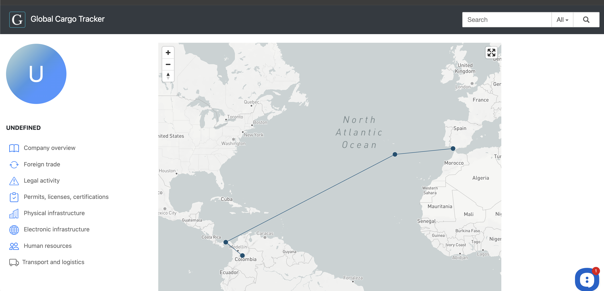

# Global Cargo Tracker (Case Study, Redacted)

`2020-2021` MVP / prototype for supply-chain traceability and cross-border cargo intelligence.

This repository is a public case study that documents the architecture, engineering decisions, and demo approach for a private project. The original source code and production-like datasets remain private.

## Why This Exists

International cargo and trade data is fragmented across many sources, formats, and jurisdictions. In practice, records may be incomplete, inconsistent, delayed, or contradictory.

The goal of the MVP was to test whether a single system could:

- ingest heterogeneous logistics / trade / company-related data,
- normalize and connect records across sources,
- detect inconsistencies,
- reconstruct a more reliable "factual picture" of a shipment / participant / trade chain,
- expose results through a searchable web interface.

## What Was Built (MVP Scope)

The private MVP combined several layers:

- data ingestion and ETL scripts (multiple sources and formats),
- data cleaning / normalization logic,
- database schema + migrations,
- verification / reconciliation views,
- web application UI for search, company pages, trade-related pages, and cargo/transport views,
- UI tests for core flows.

The implementation included a Flask-based web app with multi-language routing and a set of feature screens around search, company profiles, foreign trade, transport, and related analytical pages.

## Engineering Focus (What Makes This Relevant for Hiring)

This project is useful as an engineering case study because it required:

- designing for inconsistent and conflicting data,
- building a practical MVP across backend + data + frontend concerns,
- structuring a domain model for entities, trade events, and supporting evidence,
- balancing product scope vs. implementation speed,
- making the system explainable enough for analysts/end users (not only data pipelines).

## My Role (2020-2021)

I worked across the stack and product layer:

- Backend engineering
- Data engineering (ETL / transformations / schema work)
- Frontend implementation (MVP UI)
- Tech lead responsibilities
- Product management responsibilities

More detail: see `ROLE.md`.

## Architecture Overview (High Level)

The MVP architecture can be described as:

1. Source ingestion
2. Parsing / normalization
3. Storage (MVP DB schema + updates/migrations)
4. Reconciliation / verification logic
5. Search and entity/trade views
6. Analyst-facing UI pages

Public diagrams and a synthetic demo will be added in this repository (redacted and simplified).

## Typical User Flow (Representative MVP Path)

One representative flow in the private MVP:

1. Search by company name / code / HS code
2. Open company profile
3. Navigate to foreign trade or transport-related sections
4. Inspect linked records (transactions / docs / routes)
5. Compare inconsistent fields across sources
6. View normalized / cross-referenced result

This public case study will reproduce a simplified version of this flow on synthetic data.

## Data Quality and Verification (Core Idea)

The central engineering problem was not "just collecting data", but reconciling it.

Examples of issues the MVP had to handle:

- naming variations (same entity, different spellings / forms),
- partial identifiers,
- inconsistent dates / formats,
- source-specific missing fields,
- contradictory values across sources.

The system design therefore emphasized:

- normalization,
- cross-source linking,
- verification steps,
- explicit handling of uncertainty and partial matches.

## Reliability / Security Principles (MVP-Level)

The original project documentation and design approach emphasized:

- extensibility (new sources and flows),
- scalability considerations,
- reliability (error handling / validation checks),
- information security constraints,
- separation between public-facing outputs and sensitive data handling.

This public repository intentionally excludes secrets, private datasets, and operational details.

## What Is Public vs. Private

Public in this repository:

- case-study narrative
- architecture and data model diagrams (redacted/simplified)
- synthetic demo dataset and walkthrough
- selected screenshots/illustrations (only after review/redaction), including approved synthetic route UI screenshot(s)

Private (available only on request / walkthrough basis):

- original source code repository
- raw/legacy SQL data dumps and migrations containing real records
- source-specific integrations and credentials
- internal operational artifacts and environment-specific configuration

## Current Status of This Public Case Study

This repository is being prepared as a hiring-focused artifact.

Already included in draft form:

- architecture diagram (Mermaid)
- simplified data model
- data quality / verification notes
- privacy/redaction scope
- limitations/roadmap
- synthetic CLI demo (small synthetic dataset)
- approved synthetic transport-route UI screenshot candidate (local MVP, `demo_route`)

## Documentation (Draft)

- Architecture: `docs/architecture.md`
- Data model: `docs/data-model.md`
- Data quality and verification: `docs/data-quality-and-verification.md`
- Privacy and redaction scope: `docs/privacy-redaction.md`
- Limitations and roadmap: `docs/limitations-and-roadmap.md`
- Synthetic demo (CLI): `demo/README.md`
- Publish checklist: `PUBLISH_CHECKLIST.md`
- Safe transfer workflow: `TRANSFER_TO_PUBLIC_REPO.md`
- Screenshot triage (private-source review notes): `SCREENSHOT_TRIAGE.md`

## Visuals (Approved)

### Synthetic Transport Route (Local MVP UI)

Recommended screenshot filename:

- `assets/screenshots/transport-route-synthetic.png`

Caption:

- Synthetic route rendered in the local MVP transport page (`demo_route` mode): `Bogota -> Panama -> Cadiz`

Markdown embed (after placing the file):

```md

```

Notes:

- Captured from local MVP page with synthetic company identity (`Synthetic Export Co`)
- Suitable for public case-study use (no visible PII, no browser/desktop chrome)

## Notes on the Original MVP

- Built in `2020-2021`
- Legacy local data may have partial linkage issues after historical migrations
- For the public case study, the demo is intentionally synthetic and focused on preserving the relationship model and UX flow rather than reproducing all historical real data exactly

## How to Request a Deeper Walkthrough

If you are a hiring manager / tech lead and want a deeper review:

- architecture walkthrough
- selected code walkthrough (private, on request)
- demo session with synthetic data

## Publication Workflow (for Maintainer)

Use:

- `PUBLISH_CHECKLIST.md` before first public push
- `TRANSFER_TO_PUBLIC_REPO.md` to move this draft into a separate public repository safely

## Resume / Portfolio Label (Suggested)

`Global Cargo Tracker (private code, public case study)` - Supply Chain Traceability MVP
