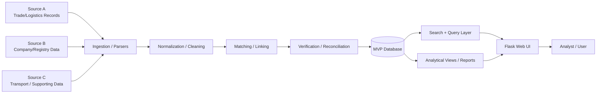

# Architecture (Redacted, Simplified)

This document describes the MVP architecture at a level suitable for technical review without exposing private integrations or sensitive implementation details.

## Scope

The original `2020-2021` MVP combined:

- source ingestion scripts
- normalization/transformation logic
- storage schema + update scripts
- verification/reconciliation logic
- web application pages for search, company, trade, and transport views

The diagram below is intentionally simplified and uses generic source labels.

## High-Level Architecture

## MVP Subsystems (Practical Grouping)

### 1. Ingestion / Parsing

- Source-specific loaders/parsers
- Batch-oriented processing
- Input formats vary by source (structured and semi-structured)

### 2. Normalization / Cleaning

- field mapping to internal schema
- formatting cleanup (dates, identifiers, text normalization)
- preparation for linking/matching

### 3. Matching / Linking

- connecting related entities and events across heterogeneous sources
- handling partial or inconsistent identifiers

### 4. Verification / Reconciliation

- comparing values from multiple sources
- tracking contradictions / missing values
- building a normalized view for UI consumption

### 5. Storage (MVP)

- relational schema for:
  - company data
  - people/roles
  - contacts/addresses
  - trade and customs-related records
  - reference dictionaries
  - processing/logging support

### 6. Web Application

- multi-language routing (URL prefix by language)
- search and autocomplete
- company detail pages and sub-sections
- trade/transport-related views

### 7. UI Test Layer

- smoke and functional checks for key screens and search flows

## Why This Architecture Was Chosen (MVP Constraints)

- Needed to validate domain/model assumptions quickly
- Required end-to-end demonstrability (not just pipeline scripts)
- Had to support analyst-style navigation through related records
- Needed room to add new sources incrementally

## What Is Intentionally Omitted

- source-specific credentials and integration details
- private endpoint mappings
- operational deployment details
- raw schema dumps and real datasets

