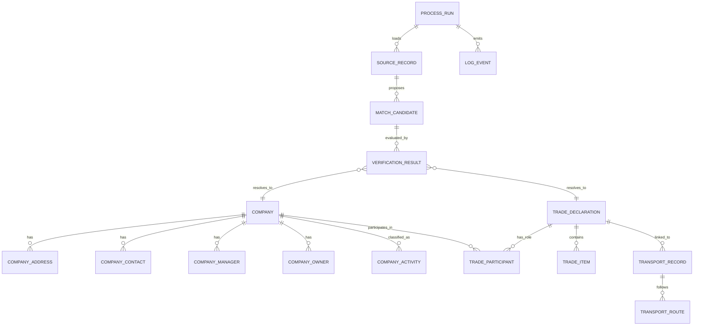

# Data Model (Simplified, Redacted)

This is a simplified conceptual model derived from the private MVP schema and feature set. It is intended to explain the engineering approach, not reproduce the original schema verbatim.

## Modeling Goal

Support a workflow where a user can:

1. search for a company / product / code
2. inspect linked trade and transport records
3. compare source-specific values
4. see a reconciled view of the same business event / entity

## Conceptual Entity Groups

### Core Business Entities

- `Company`
- `Person` (manager/owner/related person)
- `Address`
- `Contact`
- `ActivityType` / reference classifications

### Trade / Cargo Entities

- `TradeDeclaration` (customs / declaration head-level record)
- `TradeItem` / goods line (HS code, quantity, value)
- `CounterpartyLink` (shipper / consignee / buyer / declarant roles)
- `TransportRecord` (air/sea/other movement-related data)
- `TransportRoute` (origin/destination/path representation)

### Verification / System Entities

- `SourceRecord`
- `MatchCandidate`
- `VerificationResult`
- `ProcessRun`
- `LogEvent`

## Simplified Relationship Diagram

## Notes on the Real MVP vs. This Diagram

- The private MVP schema is more detailed and source-specific.
- Some tables are dictionaries/reference data and support tables.
- Some relationships in the real system are indirect and resolved through identifiers and matching logic.
- This public diagram intentionally merges and renames concepts for clarity.

## Data Quality / Reconciliation Perspective

The system design treats "record truth" as derived from evidence, not assumed from a single source.

That means the data model must support:

- multiple source records for the same business object/event
- partial matching
- conflict detection
- normalized output for UI/search

## What Will Be Demonstrated in the Synthetic Demo

The public demo will use a small subset of this model:

- `Company`
- `TradeDeclaration`
- `TradeItem`
- `TransportRecord`
- `SourceRecord`
- `VerificationResult`

This keeps the demo small while preserving the core value proposition: cross-source reconciliation.

